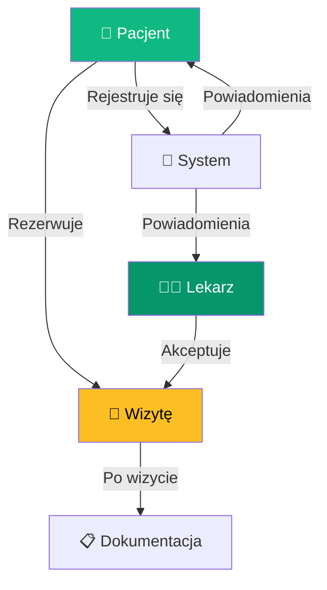
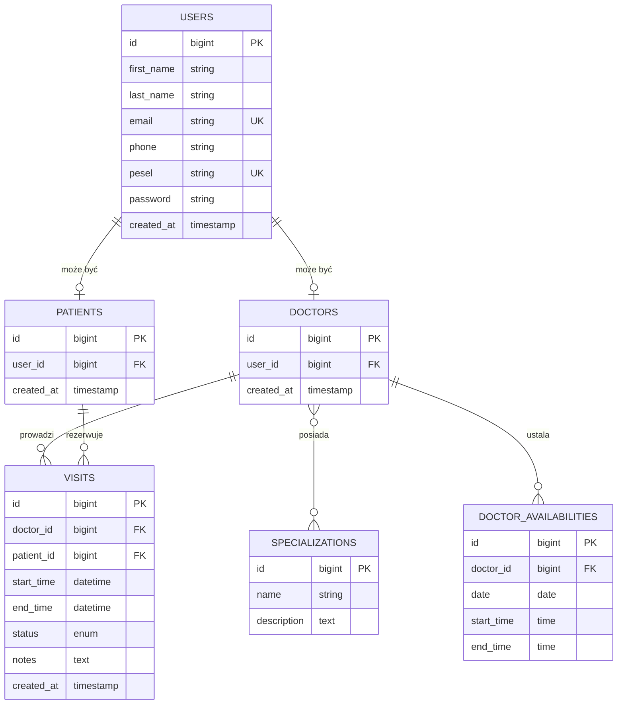

<div align="center">

<!-- ANIMATED HEADER -->


<!-- ANIMATED HEART LOGO -->
<br/>

```
    ██╗     ███████╗██╗  ██╗ █████╗ ██████╗ ██╗ ██████╗ 
    ██║     ██╔════╝██║ ██╔╝██╔══██╗██╔══██╗██║██╔═══██╗
    ██║     █████╗  █████╔╝ ███████║██████╔╝██║██║   ██║
    ██║     ██╔══╝  ██╔═██╗ ██╔══██║██╔══██╗██║██║   ██║
    ███████╗███████╗██║  ██╗██║  ██║██║  ██║██║╚██████╔╝
    ╚══════╝╚══════╝╚═╝  ╚═╝╚═╝  ╚═╝╚═╝  ╚═╝╚═╝ ╚═════╝ 
```

<h3>Twoje Zdrowie w Jednym Miejscu</h3>

<p align="center">
  <em>Kompleksowa platforma medyczna łącząca pacjentów z lekarzami</em>
</p>

<!-- BADGES -->
<p align="center">
  
  
  
  
  
</p>

<p align="center">
  
  
  
</p>

<!-- QUICK LINKS -->
<p align="center">
  <a href="#-funkcje"><strong>✨ Funkcje</strong></a> •
  <a href="#-szybki-start"><strong>🚀 Szybki Start</strong></a> •
  <a href="#-architektura"><strong>🏗️ Architektura</strong></a> •
  <a href="#-api"><strong>📡 API</strong></a> •
  <a href="#-zrzuty-ekranu"><strong>📸 Zrzuty Ekranu</strong></a>
</p>

<br/>

<!-- STATS -->
<p align="center">
  
  
  
</p>

</div>

---

<br/>

## O Projekcie

<table>
<tr>
<td width="50%">

**Lekario** to nowoczesna, pełnoprawna aplikacja webowa do zarządzania przychodnią medyczną. System został zaprojektowany z myślą o wygodzie zarówno pacjentów, jak i lekarzy, oferując intuicyjny interfejs oraz zaawansowane funkcjonalności.

### Dlaczego Lekario?

- ⏰ **Oszczędność czasu** - rezerwacja wizyty w 30 sekund
- 🔐 **Bezpieczeństwo** - zgodność z RODO
- 📱 **Responsywność** - działa na każdym urządzeniu
- 🇵🇱 **Polski interfejs** - pełna lokalizacja

</td>
<td width="50%">



</td>
</tr>
</table>

<br/>

---

## Funkcje

<div align="center">

### Dla Pacjentów

</div>

<table>
<tr>
<td align="center" width="25%">

<br/><strong>Rezerwacja Online</strong>
<br/><sub>Umów wizytę 24/7 bez dzwonienia</sub>
</td>
<td align="center" width="25%">

<br/><strong>Wybór Specjalisty</strong>
<br/><sub>Przeglądaj lekarzy po specjalizacji</sub>
</td>
<td align="center" width="25%">

<br/><strong>Interaktywny Kalendarz</strong>
<br/><sub>Wizualna dostępność terminów</sub>
</td>
<td align="center" width="25%">

<br/><strong>Powiadomienia</strong>
<br/><sub>Przypomnienia o wizytach</sub>
</td>
</tr>
<tr>
<td align="center" width="25%">

<br/><strong>Historia Wizyt</strong>
<br/><sub>Pełna dokumentacja medyczna</sub>
</td>
<td align="center" width="25%">

<br/><strong>E-Recepty</strong>
<br/><sub>Recepty w formie elektronicznej</sub>
</td>
<td align="center" width="25%">

<br/><strong>Komunikator</strong>
<br/><sub>Bezpośredni kontakt z lekarzem</sub>
</td>
<td align="center" width="25%">

<br/><strong>Anulowanie</strong>
<br/><sub>Odwołaj wizytę jednym kliknięciem</sub>
</td>
</tr>
</table>

<br/>

<div align="center">

### 👨‍⚕️ Dla Lekarzy

</div>

<table>
<tr>
<td align="center" width="25%">

<br/><strong>Panel Lekarza</strong>
<br/><sub>Dedykowany dashboard</sub>
</td>
<td align="center" width="25%">

<br/><strong>Akceptacja Wizyt</strong>
<br/><sub>Zarządzaj rezerwacjami</sub>
</td>
<td align="center" width="25%">

<br/><strong>Edycja Czasu</strong>
<br/><sub>Dostosuj czas trwania wizyty</sub>
</td>
<td align="center" width="25%">

<br/><strong>Notatki</strong>
<br/><sub>Zapisuj uwagi do wizyt</sub>
</td>
</tr>
<tr>
<td align="center" width="25%">

<br/><strong>Zaawansowane Filtry</strong>
<br/><sub>Wyszukuj pacjentów i wizyty</sub>
</td>
<td align="center" width="25%">

<br/><strong>Statystyki</strong>
<br/><sub>Dzienne/tygodniowe podsumowania</sub>
</td>
<td align="center" width="25%">

<br/><strong>Dane Pacjenta</strong>
<br/><sub>Szybki dostęp do PESEL i kontaktu</sub>
</td>
<td align="center" width="25%">

<br/><strong>Status Wizyt</strong>
<br/><sub>Oznaczaj wizyty jako zakończone</sub>
</td>
</tr>
</table>

<br/>

---

## 🏗️ Architektura

<div align="center">

```
┌─────────────────────────────────────────────────────────────────────────┐
│                           🌐 FRONTEND LAYER                              │
│  ┌──────────────┐  ┌──────────────┐  ┌──────────────┐  ┌──────────────┐ │
│  │   Blade      │  │  Tailwind    │  │   Alpine.js  │  │    Vite      │ │
│  │   Templates  │  │    CSS 4.0   │  │    3.x       │  │    7.x       │ │
│  └──────────────┘  └──────────────┘  └──────────────┘  └──────────────┘ │
└─────────────────────────────────────────────────────────────────────────┘
                                    │
                                    ▼
┌─────────────────────────────────────────────────────────────────────────┐
│                          🔧 APPLICATION LAYER                            │
│  ┌──────────────────────────────────────────────────────────────────┐   │
│  │                      Laravel Framework 12.0                       │   │
│  │  ┌────────────┐  ┌────────────┐  ┌────────────┐  ┌────────────┐  │   │
│  │  │Controllers │  │ Middleware │  │   Models   │  │  Services  │  │   │
│  │  │            │  │            │  │            │  │            │  │   │
│  │  │• Dashboard │  │• Auth      │  │• User      │  │• Booking   │  │   │
│  │  │• Visit     │  │• Doctor    │  │• Doctor    │  │• Calendar  │  │   │
│  │  │• Profile   │  │• VisitLimit│  │• Patient   │  │• Slots     │  │   │
│  │  │• Doctor    │  │• Role      │  │• Visit     │  │            │  │   │
│  │  └────────────┘  └────────────┘  └────────────┘  └────────────┘  │   │
│  └──────────────────────────────────────────────────────────────────┘   │
└─────────────────────────────────────────────────────────────────────────┘
                                    │
                                    ▼
┌─────────────────────────────────────────────────────────────────────────┐
│                           💾 DATA LAYER                                  │
│  ┌──────────────────────────────────────────────────────────────────┐   │
│  │                         Eloquent ORM                              │   │
│  │  ┌──────────┐  ┌──────────┐  ┌──────────┐  ┌──────────────────┐  │   │
│  │  │  users   │  │ doctors  │  │ patients │  │ specializations  │  │   │
│  │  └──────────┘  └──────────┘  └──────────┘  └──────────────────┘  │   │
│  │  ┌──────────┐  ┌──────────────────────┐  ┌────────────────────┐  │   │
│  │  │  visits  │  │ doctor_availabilities│  │doctor_specialization│ │   │
│  │  └──────────┘  └──────────────────────┘  └────────────────────┘  │   │
│  └──────────────────────────────────────────────────────────────────┘   │
│                                 │                                        │
│                                 ▼                                        │
│                    ┌────────────────────────┐                           │
│                    │   SQLite / MySQL       │                           │
│                    │   PostgreSQL           │                           │
│                    └────────────────────────┘                           │
└─────────────────────────────────────────────────────────────────────────┘
```

</div>

<br/>

### 📁 Struktura Projektu

```
lekario/
├── 📂 app/
│   ├── 📂 Http/
│   │   ├── 📂 Controllers/
│   │   │   ├── 🔷 DashboardController.php     # Panel pacjenta
│   │   │   ├── 🔷 VisitController.php         # Rezerwacja wizyt
│   │   │   ├── 🔷 ProfileController.php       # Profil użytkownika
│   │   │   └── 📂 Doctor/
│   │   │       ├── 🔶 DoctorDashboardController.php
│   │   │       └── 🔶 DoctorVisitController.php
│   │   ├── 📂 Middleware/
│   │   │   ├── 🛡️ CheckVisitLimit.php         # Limit 3 wizyt/dzień
│   │   │   ├── 🛡️ EnsureUserIsDoctor.php      # Autoryzacja lekarza
│   │   │   └── 🛡️ RedirectBasedOnRole.php     # Przekierowanie ról
│   │   └── 📂 Requests/                       # Walidacja formularzy
│   │
│   ├── 📂 Models/
│   │   ├── 👤 User.php                        # Model użytkownika
│   │   ├── 🩺 Doctor.php                      # Model lekarza
│   │   ├── 🏥 Patient.php                     # Model pacjenta
│   │   ├── 📅 Visit.php                       # Model wizyty
│   │   ├── ⏰ DoctorAvailability.php          # Dostępność lekarza
│   │   └── 🏷️ Specialization.php              # Specjalizacje
│   │
│   └── 📂 View/Components/                    # Komponenty Blade
│
├── 📂 resources/
│   ├── 📂 views/
│   │   ├── 🏠 welcome.blade.php               # Strona główna
│   │   ├── 📊 dashboard.blade.php             # Dashboard pacjenta
│   │   ├── 📂 auth/                           # Logowanie/Rejestracja
│   │   ├── 📂 doctor/                         # Panel lekarza
│   │   ├── 📂 visits/                         # Rezerwacja wizyt
│   │   └── 📂 layouts/                        # Szablony layoutów
│   │
│   ├── 📂 css/
│   │   └── 🎨 app.css                         # Style Tailwind
│   │
│   └── 📂 lang/pl/                            # Tłumaczenia PL
│
├── 📂 routes/
│   ├── 🛤️ web.php                             # Routing główny
│   └── 🔐 auth.php                            # Routing autoryzacji
│
├── 📂 database/
│   ├── 📂 migrations/                         # Migracje bazy danych
│   ├── 📂 factories/                          # Factories do testów
│   └── 📂 seeders/                            # Seedery danych
│
└── 📂 tests/                                  # Testy Pest/PHPUnit
```

<br/>

---

## 🗄️ Model Danych

<div align="center">



</div>

### 📊 Statusy Wizyt

| Status | Opis | Kolor |
|--------|------|-------|
| `pending` | Oczekuje na akceptację lekarza | 🟡 Żółty |
| `accepted` | Zaakceptowana przez lekarza | 🟢 Zielony |
| `completed` | Wizyta zakończona | 🔵 Niebieski |
| `rejected` | Odrzucona/Anulowana | 🔴 Czerwony |

<br/>

---

## 🚀 Szybki Start

### 📋 Wymagania

<table>
<tr>
<td align="center" width="20%">

<br/><strong>PHP 8.2+</strong>
</td>
<td align="center" width="20%">

<br/><strong>Node.js 18+</strong>
</td>
<td align="center" width="20%">

<br/><strong>Composer 2.x</strong>
</td>
<td align="center" width="20%">

<br/><strong>NPM 9+</strong>
</td>
<td align="center" width="20%">

<br/><strong>MySQL/SQLite</strong>
</td>
</tr>
</table>

### ⚡ Instalacja

<details>
<summary><strong>🔹 Opcja 1: Automatyczna instalacja (Zalecana)</strong></summary>

```bash
# 1. Sklonuj repozytorium
git clone https://github.com/aimek/Lekario.git
cd Lekario/lekario

# 2. Uruchom automatyczny setup
composer setup
```

</details>

<details>
<summary><strong>🔹 Opcja 2: Instalacja ręczna</strong></summary>

```bash
# 1. Sklonuj repozytorium
git clone https://github.com/aimek/Lekario.git
cd Lekario/lekario

# 2. Zainstaluj zależności PHP
composer install

# 3. Skopiuj plik konfiguracyjny
cp .env.example .env

# 4. Wygeneruj klucz aplikacji
php artisan key:generate

# 5. Skonfiguruj bazę danych w .env
# DB_CONNECTION=sqlite (lub mysql)
# Dla SQLite:
touch database/database.sqlite

# 6. Uruchom migracje
php artisan migrate

# 7. Zainstaluj zależności frontend
npm install

# 8. Zbuduj assets
npm run build
```

</details>

### 🏃 Uruchomienie

```bash
# 🎯 Uruchom serwer deweloperski (zalecane)
composer dev

# LUB
npm run start
```

> 🌐 Aplikacja będzie dostępna pod adresem: **http://localhost:8000**

<br/>

---

## 📡 API

### 🔗 Endpointy AJAX

<table>
<thead>
<tr>
<th>Metoda</th>
<th>Endpoint</th>
<th>Opis</th>
</tr>
</thead>
<tbody>
<tr>
<td><code>POST</code></td>
<td><code>/api/visits/doctors-by-specialization</code></td>
<td>Pobierz lekarzy według specjalizacji</td>
</tr>
<tr>
<td><code>POST</code></td>
<td><code>/api/visits/available-dates</code></td>
<td>Pobierz dostępne daty dla lekarzy</td>
</tr>
<tr>
<td><code>POST</code></td>
<td><code>/api/visits/available-slots</code></td>
<td>Pobierz wolne sloty czasowe</td>
</tr>
</tbody>
</table>

### 📝 Przykład żądania

```javascript
// Pobierz lekarzy według specjalizacji
fetch('/api/visits/doctors-by-specialization', {
    method: 'POST',
    headers: {
        'Content-Type': 'application/json',
        'X-CSRF-TOKEN': document.querySelector('meta[name="csrf-token"]').content
    },
    body: JSON.stringify({ 
        specialization_id: 1 
    })
})
.then(response => response.json())
.then(data => {
    console.log(data.doctors);
    // [{ id: 1, name: "Dr Jan Kowalski" }, ...]
});
```

<br/>

---

## 🛡️ Middleware & Security

### 🔐 Warstwa Bezpieczeństwa

| Middleware | Opis | Zastosowanie |
|------------|------|--------------|
| `auth` | Wymaga zalogowania | Wszystkie chronione trasy |
| `verified` | Wymaga zweryfikowanego email | Dashboard |
| `doctor` | Sprawdza rolę lekarza | Panel lekarza |
| `check.visit.limit` | Limit 3 wizyt/dzień | Rezerwacja wizyt |

### 🔑 System Ról

```php
// Automatyczne przekierowanie na podstawie roli
Route::get('/dashboard', function () {
    if (auth()->user()->doctor) {
        return redirect()->route('doctor.dashboard');
    }
    return app(DashboardController::class)->index();
});
```

<br/>

---

## 🧪 Testy

```bash
# Uruchom wszystkie testy
composer test

# Lub bezpośrednio przez Pest
./vendor/bin/pest

# Testy z pokryciem kodu
./vendor/bin/pest --coverage
```

### 📊 Struktura Testów

```
tests/
├── Feature/
│   ├── Auth/              # Testy autoryzacji
│   ├── ProfileTest.php    # Testy profilu
│   └── ExampleTest.php    # Testy ogólne
└── Unit/
    └── ExampleTest.php    # Testy jednostkowe
```

<br/>

---

## 🎨 Stack Technologiczny

<div align="center">

### Backend

<p>


</p>

### Frontend

<p>


</p>

### Narzędzia

<p>


</p>

</div>

<br/>

---

## 📸 Zrzuty Ekranu

<div align="center">

### 🏠 Strona Główna

<table>
<tr>
<td align="center">
<strong>Hero Section</strong>
<br/><sub>Nowoczesny, gradient design z CTA</sub>
</td>
<td align="center">
<strong>Funkcje</strong>
<br/><sub>Grid z animowanymi kartami hover</sub>
</td>
</tr>
</table>

### 📊 Dashboard Pacjenta

<table>
<tr>
<td width="50%">

**✅ Statystyki wizyt**
- Nadchodzące wizyty
- Oczekujące na akceptację  
- Zakończone wizyty

</td>
<td width="50%">

**📅 Interaktywny kalendarz**
- Podświetlenie dni z wizytami
- Oznaczenie dzisiejszej daty
- Szybki podgląd miesiąca

</td>
</tr>
</table>

### 📅 System Rezerwacji

```
┌───────────────────────────────────────────────────────────────┐
│  1️⃣ Wybierz specjalizację                                    │
│  ┌─────────┐ ┌─────────┐ ┌─────────┐ ┌─────────┐             │
│  │ Kardiolog│ │Neurolog │ │Ortopeda │ │Internista│            │
│  └─────────┘ └─────────┘ └─────────┘ └─────────┘             │
│                                                               │
│  2️⃣ Wybierz lekarza                                          │
│  ┌─────────────────────┐ ┌─────────────────────┐             │
│  │ 👨‍⚕️ Dr Jan Kowalski  │ │ 👩‍⚕️ Dr Anna Nowak    │             │
│  └─────────────────────┘ └─────────────────────┘             │
│                                                               │
│  3️⃣ Wybierz datę z kalendarza                                │
│  ┌─────────────────────────────────────────┐                 │
│  │      Styczeń 2026                       │                 │
│  │ Pn  Wt  Śr  Cz  Pt  So  Nd              │                 │
│  │          1   2   3   4   5              │                 │
│  │  6   7   8  [9] 10  11  12              │                 │
│  │ 13  14  15  16  17  18  19              │                 │
│  └─────────────────────────────────────────┘                 │
│                                                               │
│  4️⃣ Wybierz godzinę                                          │
│  ┌──────┐ ┌──────┐ ┌──────┐ ┌──────┐ ┌──────┐               │
│  │ 8:00 │ │ 8:30 │ │ 9:00 │ │ 9:30 │ │10:00 │               │
│  └──────┘ └──────┘ └──────┘ └──────┘ └──────┘               │
│                                                               │
│  ┌───────────────────────────────────────────┐               │
│  │         ✓ Potwierdź rezerwację            │               │
│  └───────────────────────────────────────────┘               │
└───────────────────────────────────────────────────────────────┘
```

### 👨‍⚕️ Panel Lekarza

<table>
<tr>
<td width="33%" align="center">
<strong>📊 Statystyki</strong>
<br/>Wizyty dziś / Oczekujące / Tydzień
</td>
<td width="33%" align="center">
<strong>⏳ Oczekujące wizyty</strong>
<br/>Akceptuj / Odrzuć / Edytuj
</td>
<td width="33%" align="center">
<strong>📋 Lista wizyt</strong>
<br/>Filtrowanie i wyszukiwanie
</td>
</tr>
</table>

</div>

<br/>

---

## 🤝 Współtworzenie

Chętnie przyjmujemy kontrybucje! 

1. 🍴 Fork repozytorium
2. 🌿 Utwórz branch (`git checkout -b feature/NowaFunkcja`)
3. 💾 Commit zmiany (`git commit -m 'Dodaj nową funkcję'`)
4. 📤 Push do brancha (`git push origin feature/NowaFunkcja`)
5. 🔃 Otwórz Pull Request

### 📝 Konwencje

- Commit messages w języku polskim lub angielskim
- Kod zgodny z PSR-12
- Testy dla nowych funkcji

<br/>

---

## 📄 Licencja

<div align="center">

Ten projekt jest licencjonowany na podstawie **MIT License**.

[](LICENSE)

</div>

<br/>

---

## 👏 Podziękowania

<div align="center">

Szczególne podziękowania dla twórców:

<p>
<a href="https://laravel.com"></a>
<a href="https://tailwindcss.com"></a>
<a href="https://alpinejs.dev"></a>
</p>

</div>

<br/>

---

<div align="center">

## 📬 Kontakt

<p>
<a href="mailto:kontakt@lekario.pl">

</a>
</p>

<br/>

---

<sub>Made with 💚 in Poland | © 2026 Lekario</sub>

<br/>


</div>